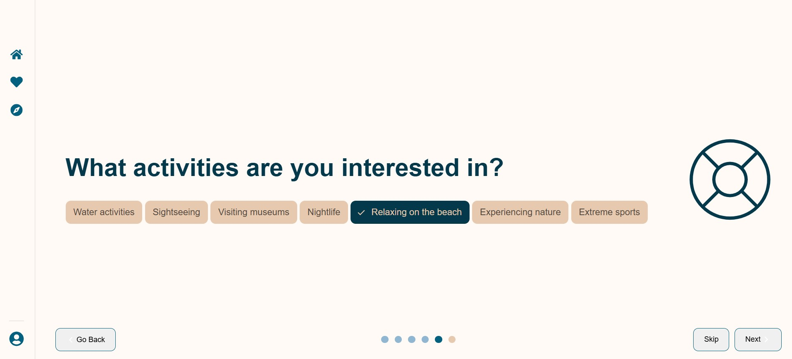

# xplore

A travel recommendation system that helps users discover destinations based on their preferences and manage favorite places.

## Features (Current)

### Backend (Django REST Framework)
- **User Authentication**: JWT-based registration/login system
- **Questionnaire**: Preference collection system with:
  - Month/weather preferences
  - Accommodation types
  - Landscape preferences
  - Activity interests
  - Cuisine 
- **Machine learning recommendation model**: 
  - Destination suggestions based on user input
  - Geographical coordinates lookup via OpenCage API
- **Favorites System**: Save and manage preferred destinations, display global favorites
- Google Places API integration for showing nearby attractions, user reviews

### Frontend (React)
- Interactive questionnaire form
- Interactive map visualization (Leaflet)
- Destination recommendations with Wikipedia integration
- Food, accommodation, attractions with ratings, opinions, photos for each place pulled from Google Places API 
- Favorite places management

### Preview
##### Homepage

##### Choosing your preferences - activities

##### Recommended destinations

##### Destination details

##### Best hotels near your destination

### Future improvements
- Trip planning dashboard
- Technical improvements such as docker deployment, automated testing, enhanced responsive design

**Note**: the project is a work in progress